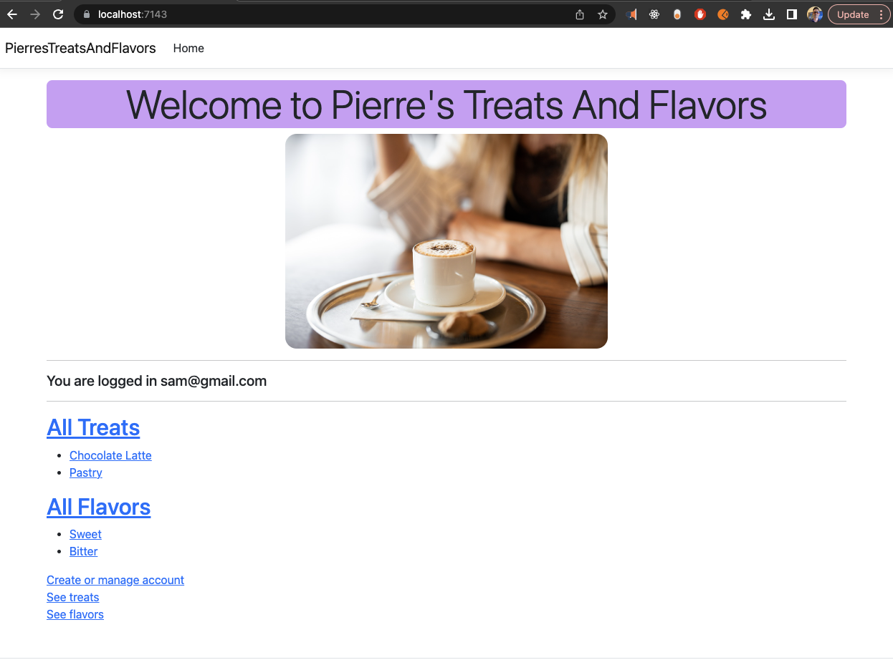
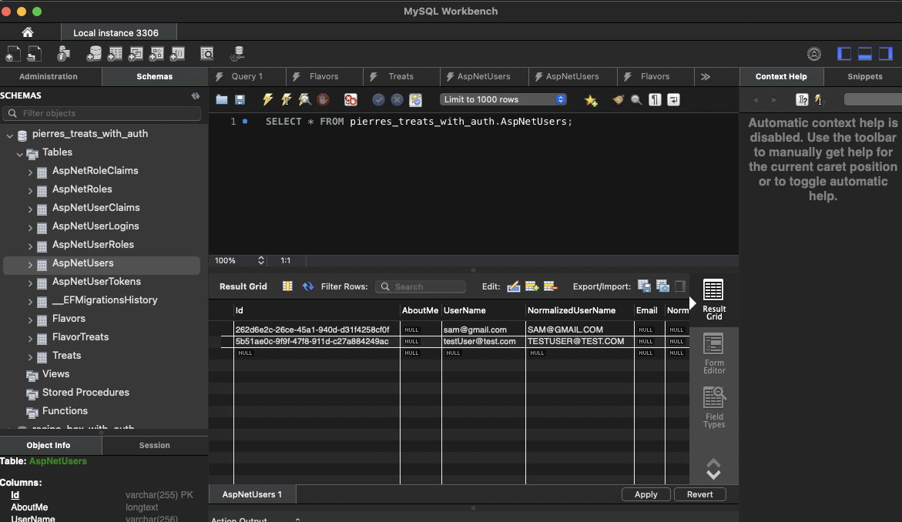
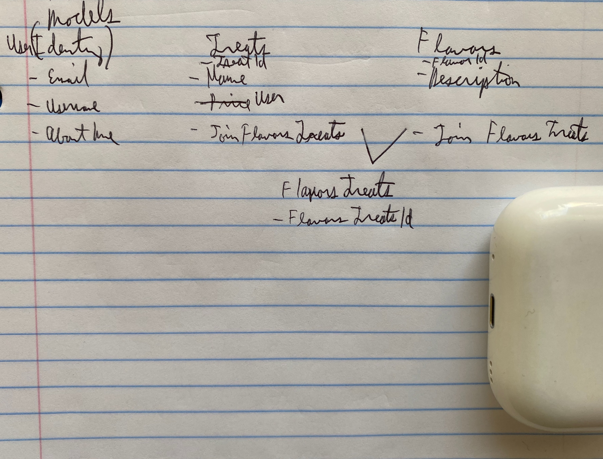

# _{Pierre's Treats And Flavors with Authentication, Authorization, Many-to-Many Data Relationships, C#, .NET and Entity Framework Core}_

#### By _**{Dan Kiss}**_


#### _{Pierre's Treats And Flavors with Authentication and Many-to-Many Data Relationships is an ASP.NET Core MVC app using Entity Framework Core. It is written in C# and allows the user to connect to to a MySQL database where the user Register for an account to go from reading data to allow create, update and delete functionality. The program will store added Treats and Flavors and once a Treat is made a Flavor can be associated with it and vice versa using a join table.}_

## Technologies Used

* Entity Framework Core
* Authentication with the Identity Model in ASP.NET Core
* Join Table Model
* MySQL
* MySQL Workbench
* ASP.NET Core MVC
* .NET Core
* .NET CLI
* C#
* Razor
* CSS

## Description

To run the application navigate to the PierresTreatsAndFlavors folder in the command line and add a file named appsettings.json that is filled in as below, change [username] and [password] to the username and password you have in MySQL server. MySQL server must be installed on your machine to run this project.

```
{
    "ConnectionStrings": {
    "DefaultConnection": "Server=localhost;Port=3306;database=pierres_treats_with_auth;uid=[username];pwd=[password];"
}
}
```

Once you have set up appsettings.json while in the PierresTreatsAndFlavors folder run 

$ dotnet restore

Now add the database called pierres_treats_with_auth and see it in MySQL Workbench.

In the Factory folder run the migration
$ dotnet ef database update

If wanted to add new columns in MySQL make a new migration and run the command below, change [DescribeYourMigration] to a description you like and remember to commit the changes.
$ dotnet ef migrations add [DescribeYourMigration]
To include the new database migration again run
$ dotnet ef database update



After you are finished with the above steps, go to MySQL the Navigator > Schemas tab. Right click and select Refresh All. Our new test database and tables will appear.

Database Tables



Now go to the PierresTreatsAndFlavors folder and run

$ dotnet run

As Entity Framework Core is used with the standard naming convention there is not testing added as there is not unique functions used that should be tested.

## Setup/Installation Requirements

* _navigate to the Factory folder and run_
* _$ dotnet restore_
* _run $ dotnet run_
* _Go to localhost:7143_
* _Click Create Account or Login_
* _Click Register_
* _Fill out the info and click create account_
* _You are logged in and take back to the homepage, if account was not created you get a message of what to adjust_
* _Click All Treats_
* _Click Create a treat and fill it out then click Add new treat_
* _Make another Treat_
* _Click Home at the top of the screen_
* _Click Add New Flavor fill it out then click Add new flavor_
* _Make another flavor_
* _Click Home at the top of the screen_
* _Click on the text of the treat you made to see its details page_
* _Click Add a flavor to this treat_
* _Select the flavor you want from the dropdown and click save_
* _Go back to the item detail page and see the flavor associated with it_
* _Note for CRUD actions, you need an account to have CUD actions, you can R without an account but an account is recommended_

_{Double check that the bin and obj folders are created in the PierresTreatsAndFlavors folder}_

## Known Bugs

* _None_

## Idea to expand on

* _Make it so that an account that is not logged in does not see action for creating, updating or deleting treats or flavors. Make it so only the person who created the treat or flavor can update or delete it.

## Notes on project

* _Important to ensure the model is passed to the View when needed using View(model) to avoid NullReferenceException_
* _The naming convention for Entity Framework Core must be followed in the model to be able to capture all data from the form used to create new objects from Views including SelectList dropdowns_
* _Use @Html.HiddenFor(model => model.User.Id) to associate the ApplicationUser Id to the treat_
* _.NET CLI was used to make initial project structure $ dotnet new mvc_
* _.The packages you need are in PierresTreatsAndFlavors.csproj_
* _.For Entity Framework Core, we use a tool called dotnet-ef to create migrations and update our database. We'll install this tool globally so that it is always available in all of our projects. Run the following command in your terminal now $ dotnet tool install --global dotnet-ef --version 6.0.0_
* _.In order to use dotnet-ef, we also need to install the Microsoft.EntityFrameworkCore.Design package in our ASP.NET Core projects. Within the production directory of our To Do List app, run the following command $ dotnet add package Microsoft.EntityFrameworkCore.Design -v 6.0.0_

## Git Note
Remove bin and obj folders from git with 
$ git rm --cached obj -r 
$ git rm --cached bin -r

## License

_{MIT License}_

Copyright (c) _2023_ _Daniel Kiss_